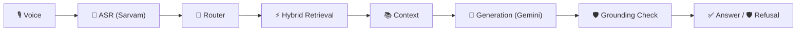

# RAGForge Goa

**Speak. Retrieve. Reason. Know when not to answer.**

*Low-latency voice RAG with adaptive retrieval and grounded guardrails.*

Built for HackerHouse Goa 2026 — Task 2: Build a Voice-Enabled RAG Model.

---

## The problem

"Microphone → transcript → embedding → vector DB → LLM" is the default shape
of a voice RAG demo, and it has three failure modes judges have seen a
hundred times: it always answers (even when the corpus has nothing
relevant), it treats every question the same way (a lookup for "how far is
X from Y" gets the same retrieval strategy as "what is the significance of
Y"), and it chunks documents with one fixed window regardless of what's
actually in them. None of that is a matter of taste — each one is
measurable, and RAGForge Goa measures and addresses all three.

## Why conventional RAG is insufficient here

| Generic voice RAG | RAGForge Goa |
|---|---|
| Voice → transcript → vector search → LLM | Voice → ASR → query analysis → **adaptive retrieval routing** → dense + sparse → fusion → **context expansion** → **grounded generation** → **verification** → answer/refusal |
| One chunking strategy for every document | Chunking strategy chosen by passage length, tagged and comparable per-strategy |
| Always answers something | Refuses when evidence is insufficient, with the evidence score and reason shown |
| Latency asserted | Latency measured: P50/P70/P90/P95/P99/P100 from a real benchmark harness, cold vs. warm |

## Architecture



Full diagram, stage-by-stage rationale, and error-recovery table:
[docs/architecture.md](docs/architecture.md).

## Adaptive retrieval

A heuristic router (`src/routing/router.py`) picks the retrieval strategy
per query from signals that are free at query time — MS MARCO's own
`query_type` label when available, plus token count and lexical
specificity computed from the query text — so it works identically on real
ASR transcripts. Five strategies: `dense`, `sparse`, `hybrid`,
`hybrid_rerank` (adds a cross-encoder pass for entity/number-heavy queries),
and `multi_query` (lexical-variant expansion for short/ambiguous queries,
deliberately not an LLM call — see [docs/decisions.md](docs/decisions.md)
for why). Details and the strategy table: [docs/architecture.md](docs/architecture.md#why-adaptive-retrieval-not-a-single-strategy).

## Chunking strategies

Passages under a token threshold stay atomic; longer ones are split three
ways (fixed-window, sentence-aware, overlapping) with `parent_id` links back
to the full passage, enabling context expansion when a matched fragment
needs its surrounding text. Every chunk carries its strategy, position, and
neighbor ids as metadata, so retrieval quality is measured per-strategy, not
assumed. Two full index variants are built offline
(`scripts/build_index.py`): a naive uniform-chunking baseline and the
adaptive RAGForge index, for a real ablation. Details:
[docs/architecture.md](docs/architecture.md#why-adaptive-chunking-not-one-fixed-window).

## Guardrails

Five layers, each matched to what it can actually know: an unsafe-query
filter, prompt-injection detection (context is always untrusted data inside
`<context>` tags, never part of the system prompt), a calibrated retrieval-
confidence gate, a context-sufficiency gate, and a post-generation
groundedness check (lexical overlap between the answer and retrieved
context). Refusal is a normal, typed pipeline outcome, not an error.
Rationale for each threshold: [docs/decisions.md](docs/decisions.md).

## Latency engineering

Every stage (ASR, query processing, embedding, retrieval, reranking,
generation, guardrails) is timed independently with `time.perf_counter` and
returned in every response's `latency_ms`. **What's measured**: the full
live path from a text/audio query through the deployed API to a
answered/refused response, including real network calls to Sarvam and
Gemini — not a retrieval-only number dressed up as end-to-end latency. Cold
(first N requests after startup) is reported separately from warm. See
[docs/latency.md](docs/latency.md) for the actual benchmark run
(`scripts/benchmark.py`, 100+ live queries) — no number in that file is
hand-picked or hard-coded.

Practical optimizations actually in the code: a precomputed, in-memory
NumPy dense index (no FAISS — see [docs/decisions.md](docs/decisions.md) for
why that's a reliability decision, not a performance one), concurrent
dense+sparse search via `asyncio.gather`, pre-generation guardrail gates that
skip the LLM call entirely when retrieval confidence is already too low, and
a minimal, single-call generation prompt.

## Evaluation

`scripts/evaluate.py` reports recall@k and MRR for RAGForge vs. the naive
baseline, broken down by chunking strategy and isolating the
context-expansion subset (queries whose gold passage was long enough to be
split), plus — when a Gemini key is available — refusal precision/recall
and hallucination rate over a labeled set spanning easy/semantic/keyword-
heavy/ambiguous/context-expansion/no-answer-in-dataset/off-topic/
adversarial/prompt-injection/noisy-ASR-like queries. Full methodology and
results: [docs/evaluation.md](docs/evaluation.md).

## Demo

1. **Normal question** — semantic query, dense retrieval, grounded answer.
2. **Keyword-heavy question** — router selects sparse/hybrid, shown live.
3. **Conceptual question** — router selects dense.
4. **Unanswerable question** — system refuses, shows evidence score.
5. **Prompt injection** — "ignore previous instructions..." is flagged and
   ignored; the system still answers (or refuses) the real question.
6. **Performance** — live telemetry panel, real P50/P70/P95/P100.

## Deployment

**Backend → Railway. Frontend → Vercel.** (An earlier `render.yaml` is kept
for reference but is not the active deployment target.)

Indices are committed via Git LFS (`data/processed/`), and the embedding +
reranker model weights are baked into the Docker image at build time
(`Dockerfile`) — so a fresh container never recomputes embeddings, rebuilds
an index, or downloads anything from HuggingFace at startup or request
time. It only loads what's already in the image. See
[docs/architecture.md](docs/architecture.md) for what's in the request path
at runtime vs. what's offline-only.

**Railway (backend)**

1. Connect this repo (or `railway up` from a local checkout). Railway
   detects `railway.json` and builds from the committed `Dockerfile`.
2. Set environment variables in the Railway service settings:
   - `GEMINI_API_KEY`
   - `SARVAM_API_KEY`
   - `RAGFORGE_CONFIG=configs/production.yaml`
   - `CORS_ORIGINS=https://your-app.vercel.app` (the deployed Vercel URL —
     comma-separated if you need more than one, e.g. to also allow a
     Vercel preview URL)
3. Railway assigns the container's port via `$PORT`; the Dockerfile's `CMD`
   already binds to it (`--port ${PORT:-8420}`) rather than a hardcoded port.
4. Verify: `curl https://<railway-url>/health` should return
   `{"status": "ok", "chunks_indexed": 122580, ...}`.

**Vercel (frontend)**

1. Import `frontend/` as the project root (framework preset: Vite).
2. Set `VITE_API_BASE_URL=https://<your-railway-backend>` as an environment
   variable in Vercel's project settings (this is a public, non-secret
   value — no API keys ever go in the frontend).
3. Build command `npm run build`, output directory `dist` (Vercel's Vite
   preset sets these automatically).

## Setup (local development)

```bash
python -m venv .venv && source .venv/bin/activate
pip install -r requirements-dev.txt   # includes requirements.txt + test/dataset tooling
cp .env.example .env   # fill in GEMINI_API_KEY, SARVAM_API_KEY
```

(`requirements.txt` alone is the minimal production/runtime set the Docker
image installs; `requirements-dev.txt` adds `datasets`/`pandas`/`pytest` for
local rebuilding and testing.)

The curated dataset subset and prebuilt indices are already committed
(`data/raw/msmarco_xi.jsonl`, `data/processed/`). To rebuild from scratch:

```bash
python scripts/download_dataset.py   # pulls a fresh subset from HF
python scripts/build_index.py        # chunks, embeds, builds both index variants
```

Run the API:

```bash
uvicorn api.main:app --reload --port 8420
```

Run the frontend (separate terminal):

```bash
cd frontend
npm install
cp .env.example .env   # VITE_API_BASE_URL, defaults to localhost:8420 if unset
npm run dev
```

Run tests:

```bash
pytest tests/unit tests/integration tests/benchmark -q
```

## API

```
POST /api/query      multipart form: `text` and/or `audio` file -> PipelineResponse
GET  /health          liveness + what's configured
GET  /metrics         latency percentiles from the request log
POST /benchmark       small in-process live-latency sample
```

`PipelineResponse` (see `src/pipeline/schemas.py`):

```json
{
  "status": "answered",
  "answer": "...",
  "sources": [{"chunk_id": "...", "doc_id": "...", "chunking_strategy": "sentence",
               "dense_score": 0.81, "sparse_score": null, "final_score": 0.81}],
  "confidence": 0.81,
  "retrieval_strategy": "dense",
  "latency_ms": {"asr": 0, "retrieval": 12.4, "generation": 640.1, "total": 671.0}
}
```

Refusal:

```json
{
  "status": "refused",
  "reason": "low_retrieval_confidence",
  "answer": "I couldn't find sufficient evidence in the knowledge base to answer this question reliably.",
  "confidence": 0.41
}
```

## Limitations

- Corpus is a ~6,000-query curated subset of MSMARCO-XI's validation split,
  not the full 10M-row dataset — a deliberate scope decision for a
  demo-reliable index, not a hidden constraint (see
  [docs/decisions.md](docs/decisions.md)).
- Groundedness verification is a lexical-overlap heuristic, not a second LLM
  judge — chosen for latency and determinism; a paraphrased-but-grounded
  answer can score lower than a copied one.
- Multi-query expansion uses lexical variants, not LLM-generated
  paraphrases — a deliberate latency tradeoff, documented in
  [docs/decisions.md](docs/decisions.md).
- Voice input is English/Hindi-tested; Sarvam supports 22+ Indic languages
  but only Hindi was exercised during development.

## Future work

- Learned router (currently a justified, benchmarked heuristic).
- LLM-based groundedness judge as a slower, higher-precision second opinion
  behind the fast lexical gate.
- Streaming generation for perceived-latency reduction on longer answers.

---

Repository structure, benchmark/evaluation methodology, and every threshold
in this system have a documented reason in `docs/`. Nothing here is
asserted without a number behind it.
