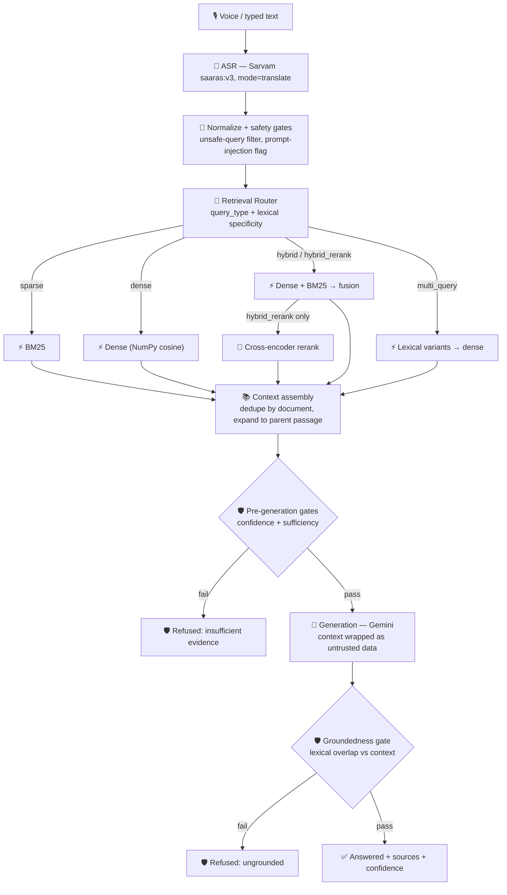

# Architecture

## Request flow

## Why adaptive retrieval, not a single strategy

A fixed retrieval strategy is a bet that one signal (semantic similarity, or
exact terms) is always right. It isn't: "what is the significance of serial
dilution" needs semantic recall; "how far is eureka ca to klamath falls"
needs the numbers and place names to match exactly. The router
(`src/routing/router.py`) picks per-query using signals that are already
free: MS MARCO's own `query_type` label when available (DESCRIPTION vs.
NUMERIC/ENTITY/PERSON/LOCATION), plus token count, digit density, and
proper-noun density computed from the query text itself -- so the same
router works on real ASR transcripts, which have no `query_type`.

| Strategy | When | What runs |
|---|---|---|
| `dense` | low lexical specificity (conceptual/descriptive) | embed, cosine search |
| `sparse` | very high lexical specificity | BM25 |
| `hybrid` | moderate specificity | dense + BM25, min-max normalized, weighted fusion |
| `hybrid_rerank` | specific + entity/number-bearing | hybrid pool → cross-encoder (`ms-marco-MiniLM-L-6-v2`) |
| `multi_query` | very short/ambiguous (≤3 tokens) | lexical variants → dense, merged by max score |

## Why adaptive chunking, not one fixed window

MS MARCO passages are already short (median 48 words) -- most stay atomic
(parent == child, nothing gained by slicing a 40-token passage). Passages
over `atomic_max_tokens` (90) get split three ways -- fixed-window,
sentence-aware, overlapping -- all pointing back at the same parent passage
via `parent_id`, so a precise child chunk that matched the query can be
**expanded back to the full parent passage** for generation context (the
"context expansion" strategy) instead of handing the model a truncated
fragment. Every chunk carries `chunking_strategy`, `position`, and
`neighbor_chunk_ids`, so retrieval quality can be sliced by strategy after
the fact (`scripts/evaluate.py`) rather than assumed.

Two index variants are built (`scripts/build_index.py`):

- **baseline**: uniform fixed-window chunking applied regardless of passage
  length, dense-only retrieval, no router -- the naive-RAG strawman the
  ablation study compares against.
- **ragforge**: adaptive chunking as above, hybrid dense+BM25, full router.

Both are prebuilt entirely offline. The runtime path never chunks, embeds
the corpus, or builds an index -- it loads the artifacts `build_index.py`
already produced and only ever embeds the live query.

## Guardrails, layered by what each signal actually knows

1. **Unsafe-query filter** (regex, pre-retrieval) -- refuses before spending
   any retrieval/generation budget.
2. **Prompt-injection detection** (regex, flagged not gated) -- retrieved
   context is always wrapped as untrusted data inside `<context>` tags in
   the user turn (never the system prompt), so injected instructions in
   either the query or retrieved passages can't override behavior regardless
   of whether this heuristic fires.
3. **Retrieval confidence gate** -- calibrated per-signal-type score (see
   `docs/decisions.md`) below threshold → refuse before calling the LLM at
   all. Tuned to catch off-topic/out-of-corpus queries specifically.
4. **Context sufficiency gate** -- fewer than the minimum surviving context
   chunks → refuse.
5. **Groundedness gate** (post-generation) -- lexical content-word overlap
   between the answer and retrieved context below threshold → refuse instead
   of returning the answer. This is what actually catches MS MARCO's
   "topically relevant passages, no clean answer" cases (see
   `docs/decisions.md` for why retrieval-side checks can't).

Refusal is a normal, successful pipeline outcome (`status: "refused"`), not
an error path -- the orchestrator (`src/pipeline/orchestrator.py`) returns a
fully-formed `PipelineResponse` with a `reason` for every gate.

## Error recovery

| Failure | Recovery |
|---|---|
| ASR request fails | one retry (tenacity), then a typed `error` response -- no raw exception reaches the client |
| Retriever returns nothing | confidence/sufficiency gates catch it as a normal refusal |
| Generation fails/times out | one retry, then a typed `error` response |
| Generation returns ungrounded content | groundedness gate refuses rather than returning it |

## Telemetry

Every request times ASR, query processing, query embedding, retrieval,
reranking, generation, and guardrail checks independently
(`src/telemetry/timing.py`), and appends a structured record (request id,
status, strategy, confidence, latency breakdown) to
`data/benchmarks/requests.jsonl` (`src/telemetry/logging_utils.py`) --
raw audio and full transcripts are not logged. `GET /metrics` computes
P50/P70/P90/P95/P99/P100 from that log on demand; `scripts/benchmark.py` is
the authoritative, larger offline run behind `docs/latency.md`.
